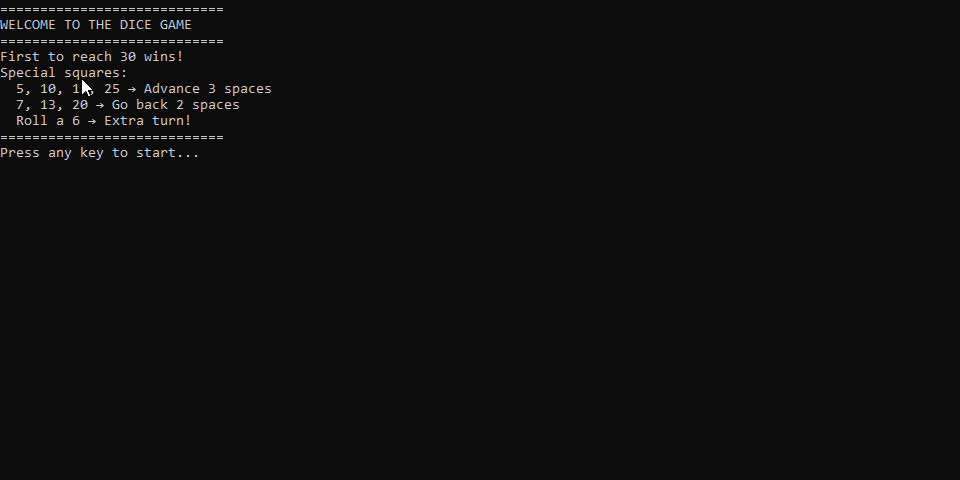

# JOGO DO DADOS

## Introdução

- Jogo de dados baseado em turnos, versus o computador (PC). No início é exibido um menu com as condições de vitória, o primeiro a atingir 30 ou mais vitórias, bônus especiais em algumas caixas.


## Como utilizar
- Clone o repositório ou baixe o código fonte.
- Abra o terminal ou o prompt de comando e navegue até a pasta raiz
- Utilize o comando abaixo para restaurar as dependências do projeto.

```
dotnet restore
```
- Para executar o projeto compilando em tempo real
```
dotnet run --project JogoDosDados.ConsoleApp
```
## Requisitos

- .NET 10.0 SDK 